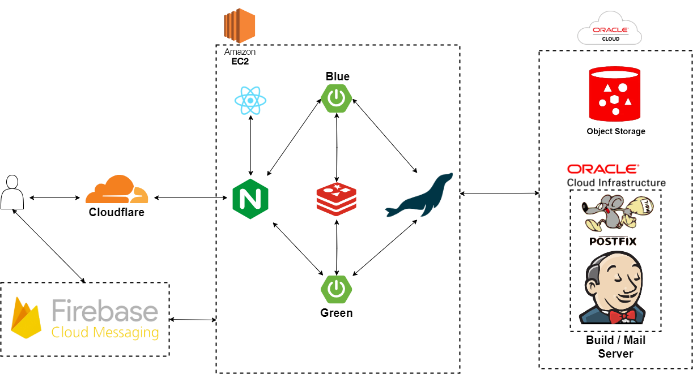
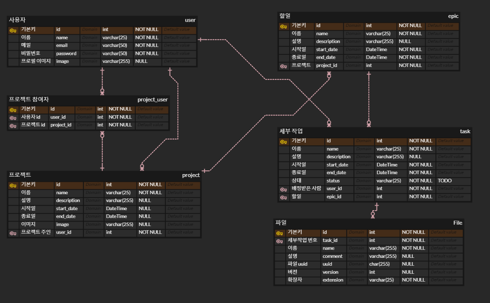
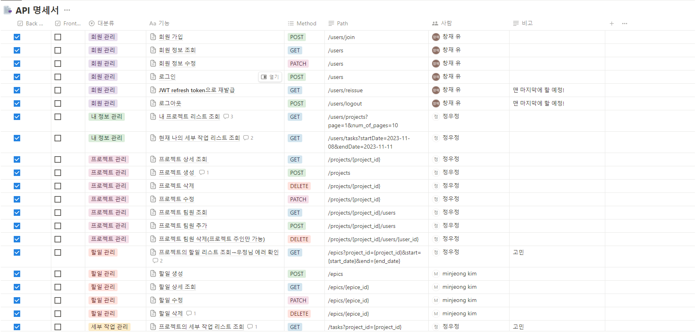
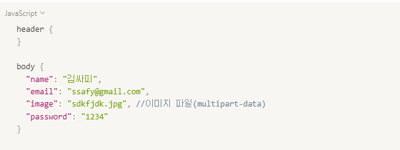
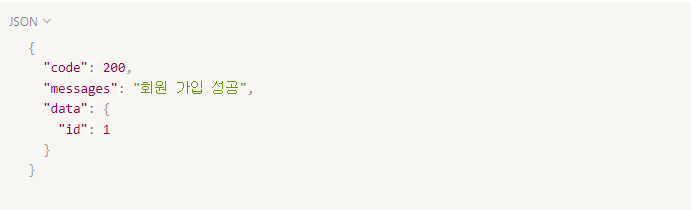
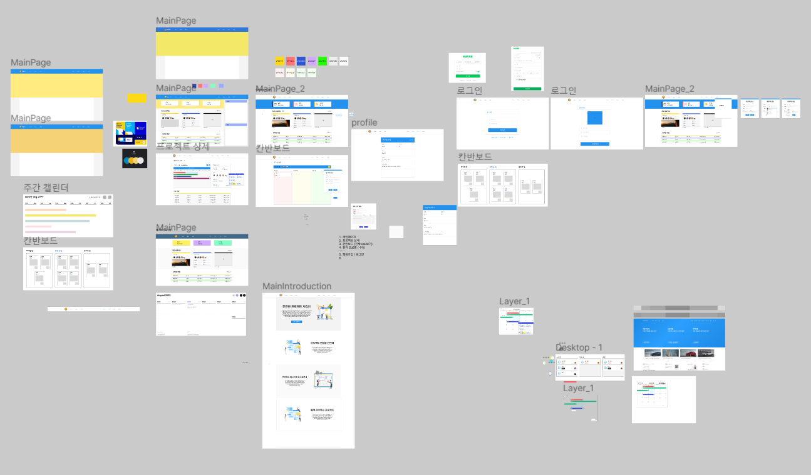

# ProjPolice


## 📖목차

- [프로폴리스](#ProjPolice)
  - [📖목차](#목차)
  - [프로젝트 진행 기간](#프로젝트-진행-기간)
  - [❤ 팀 소개](#-팀-소개)
    - [팀명](#팀명)
    - [팀원 소개](#팀원-소개)
    - [Frontend](#frontend)
    - [Backend](#backend)
  - [🎉 프로젝트 요약](#-프로젝트-요약)
  - [✨주요 기능 및 구현](#주요-기능-및-구현)
  - [🖥 서비스 화면](#-서비스-화면)
  - [🏗️ 아키텍쳐](#️-아키텍쳐)
  - [🛠 기술 스택](#-기술-스택)
  - [📂 파일 구조](#-파일-구조)
  - [📝 설계 문서](#-설계-문서)
    - [ERD](#erd)
    - [API](#api)
    - [FIGMA](#figma)
  - [📚 컨벤션](#-컨벤션)
    - [Ground Rule](#ground-rule)
  - [🥇 프로젝트 수칙](#-프로젝트-수칙)
    - [💻 회의 진행](#-회의-진행)
    - [💻 코드 리뷰](#-코드-리뷰)
    - [💻 코드 작성](#-코드-작성)
    - [💻 깃 관리](#-깃-관리)
    - [Git Commit](#git-commit)
    - [Git Branch](#git-branch)
- [브랜치 명명 컨벤션](#브랜치-명명-컨벤션)
  - [Git flow](#git-flow)
    - [Codding](#codding)
    - [Jira](#jira)
  - [💻 구동 방법](#-구동-방법)
  - [💾 결과물](#-결과물)
    - [UCC](#ucc)
    - [시연 영상](#시연-영상)

---

## 프로젝트 진행 기간

`2023.10.10 ~ 2023.11.17 (약 6주)`

---

## ❤ 팀 소개

### 팀명

> 📢 안녕하세요! 팀《저무임승차할게요ㅋㅋ그럼선배님이름도뺄게요ㅎㅎ》입니다.

### 팀원 소개

### Frontend

|                                                                         |                                                                         |                                                                         |     |
| :---------------------------------------------------------------------: | :---------------------------------------------------------------------: | :---------------------------------------------------------------------: | :-: |
| <br>**윤민영** | <br>**임혜진** | <br>**진익근** |

---

### Backend

|                                                                         |                                                                         |                                                                         |     |
| :---------------------------------------------------------------------: | :---------------------------------------------------------------------: | :---------------------------------------------------------------------: | :-: |
| <br>**김민정** | <br>**유창재** | <br>**정우정** |

---

## 🎉 프로젝트 요약

💡 **프로젝트 명**: 프로폴리스

**목적**: 프로젝트 일정 관리와 파일 관리를 동시에 직관적으로 할 수 있는 서비스 (타겟: 프로젝트 초심자 및 입문자)

**기대효과**:

- 프로젝트 흐름 시각화를 통해 일정 및 작업 현황, 파일까지 쉽게 볼 수 있음
- 프로젝트 과정에 대한 산출물 버전관리
- 파일 업로드 시 다양한 포맷의 파일 업로드 지원
- 알림 서비스 제공

**차별점**:

- Oracle Cloud를 사용하여 파일 저장에 관한 오브젝트 스토리지를 제공, 비용 절감
- Cloudflare를 통해 캐싱 담당 및 트래픽 절감
- postfix smtp 서버를 통해 사용자에게 메일을 통한 알림 서비스 제공

---

## ✨주요 기능 및 구현

---

## 🖥 서비스 화면

<summary>메인 페이지</summary>
<div markdown="1">


</div>

<summary>회원가입 페이지</summary>
<div markdown="1">


</div>

---

## 🏗️ 아키텍쳐
<div align=center>

</div>

---

## 🛠 기술 스택

<div align=center>
<!-- 백엔드 -->


<!-- 데이터베이스 -->


<!-- 프론트엔드 -->


<!-- 인프라 -->


</div>

---

## 📂 파일 구조

<details  style="margin-left: 5px;">
<summary><b>프론트 프로젝트 구조</b></summary>
<div>

```
📦src
 ┣ 📂api
 ┃ ┣ 📜epic.ts
 ┃ ┣ 📜file.ts
 ┃ ┣ 📜http.ts
 ┃ ┣ 📜project.ts
 ┃ ┣ 📜task.ts
 ┃ ┗ 📜user.ts
 ┣ 📂common
 ┃ ┣ 📂assets
 ┃ ┃ ┣ 📂design
 ┃ ┃ ┃ ┣ 📜colors.ts
 ┃ ┃ ┃ ┗ 📜globalStyles.ts
 ┃ ┃ ┣ 📂fonts
 ┃ ┃ ┃ ┣ 📜esamanru-Bold.ttf
 ┃ ┃ ┃ ┣ 📜esamanru-Light.ttf
 ┃ ┃ ┃ ┗ 📜esamanru-Medium.ttf
 ┃ ┃ ┣ 📂icons
 ┃ ┃ ┃ ┣ 📜.gitkeep
 ┃ ┃ ┃ ┣ 📜AddButton.png
 ┃ ┃ ┃ ┣ 📜Calendar.png
 ┃ ┃ ┃ ┣ 📜LeftArrow.png
 ┃ ┃ ┃ ┣ 📜Menu.png
 ┃ ┃ ┃ ┣ 📜RightArrow.png
 ┃ ┃ ┃ ┗ 📜Stick.png
 ┃ ┃ ┗ 📂images
 ┃ ┃ ┃ ┣ 📜OIG.nKccMkZXR.jfif
 ┃ ┃ ┃ ┗ 📜ProjPoliceIcon.png
 ┃ ┣ 📂hooks
 ┃ ┃ ┣ 📜useFileInput.ts
 ┃ ┃ ┗ 📜useTextInput.ts
 ┃ ┣ 📂interfaces
 ┃ ┃ ┣ 📜hook.ts
 ┃ ┃ ┣ 📜main.ts
 ┃ ┃ ┣ 📜state.ts
 ┃ ┃ ┣ 📜task.ts
 ┃ ┃ ┣ 📜user.ts
 ┃ ┃ ┣ 📜utils.ts
 ┃ ┃ ┗ 📜widgets.ts
 ┃ ┣ 📂utils
 ┃ ┃ ┗ 📜moveItem.ts
 ┃ ┗ 📂widgets
 ┃ ┃ ┣ 📂buttons
 ┃ ┃ ┃ ┗ 📜ProjPoliceButton.tsx
 ┃ ┃ ┣ 📂modals
 ┃ ┃ ┃ ┣ 📜CreateProjectModal.tsx
 ┃ ┃ ┃ ┣ 📜CreateTaskModal.tsx
 ┃ ┃ ┃ ┗ 📜ModalStyle.tsx
 ┃ ┃ ┣ 📜NavigationBar.tsx
 ┃ ┃ ┗ 📜Space.tsx
 ┣ 📂pages
 ┃ ┣ 📂main
 ┃ ┃ ┣ 📂components
 ┃ ┃ ┃ ┣ 📂Header
 ┃ ┃ ┃ ┃ ┗ 📜HeaderBox.tsx
 ┃ ┃ ┃ ┣ 📂ProjectList
 ┃ ┃ ┃ ┃ ┗ 📜ProjectItem.tsx
 ┃ ┃ ┃ ┣ 📂TaskList
 ┃ ┃ ┃ ┃ ┗ 📜TaskItem.tsx
 ┃ ┃ ┃ ┣ 📜Header.tsx
 ┃ ┃ ┃ ┣ 📜ProjectList.tsx
 ┃ ┃ ┃ ┗ 📜TaskList.tsx
 ┃ ┃ ┣ 📜interfaces.ts
 ┃ ┃ ┣ 📜Main.tsx
 ┃ ┃ ┗ 📜MainStyle.ts
 ┃ ┣ 📂profile
 ┃ ┃ ┣ 📜interfaces.ts
 ┃ ┃ ┣ 📜Profile.tsx
 ┃ ┃ ┗ 📜ProfileStyle.tsx
 ┃ ┣ 📂project
 ┃ ┃ ┣ 📂components
 ┃ ┃ ┃ ┣ 📜MemberList.tsx
 ┃ ┃ ┃ ┣ 📜MemberPhotoList.tsx
 ┃ ┃ ┃ ┣ 📜ProjectCalendar.tsx
 ┃ ┃ ┃ ┣ 📜ProjectCalendarTimeline.tsx
 ┃ ┃ ┃ ┣ 📜ProjectDetail.tsx
 ┃ ┃ ┃ ┣ 📜ProjectEpicList.tsx
 ┃ ┃ ┃ ┣ 📜TaskDetail.tsx
 ┃ ┃ ┃ ┗ 📜TimelineList.tsx
 ┃ ┃ ┣ 📜Project.tsx
 ┃ ┃ ┗ 📜ProjectStyle.tsx
 ┃ ┣ 📂task
 ┃ ┃ ┣ 📂components
 ┃ ┃ ┃ ┣ 📜Board.tsx
 ┃ ┃ ┃ ┗ 📜BoardItem.tsx
 ┃ ┃ ┣ 📜Task.tsx
 ┃ ┃ ┗ 📜TaskStyle.tsx
 ┃ ┗ 📂user
 ┃ ┃ ┣ 📂components
 ┃ ┃ ┣ 📜Login.tsx
 ┃ ┃ ┣ 📜SignUp.tsx
 ┃ ┃ ┗ 📜UserStyle.ts
 ┣ 📂state
 ┃ ┣ 📜persist.tsx
 ┃ ┣ 📜project.tsx
 ┃ ┗ 📜user.tsx
 ┣ 📜App.tsx
 ┣ 📜firebase.ts
 ┣ 📜root.tsx
 ┣ 📜Router.tsx
 ┗ 📜vite-env.d.ts
```

</div>
</details>
<br>
<details style="margin-left: 5px;">
<summary><b>백엔드 프로젝트 구조</b></summary>
<div>

```
📦src
 ┣ 📂main
 ┃ ┣ 📂java
 ┃ ┃ ┗ 📂com
 ┃ ┃ ┃ ┗ 📂projpolice
 ┃ ┃ ┃ ┃ ┣ 📂domain
 ┃ ┃ ┃ ┃ ┃ ┣ 📂epic
 ┃ ┃ ┃ ┃ ┃ ┃ ┣ 📂controller
 ┃ ┃ ┃ ┃ ┃ ┃ ┃ ┗ 📜EpicController.java
 ┃ ┃ ┃ ┃ ┃ ┃ ┣ 📂domain
 ┃ ┃ ┃ ┃ ┃ ┃ ┃ ┗ 📜Epic.java
 ┃ ┃ ┃ ┃ ┃ ┃ ┣ 📂dto
 ┃ ┃ ┃ ┃ ┃ ┃ ┃ ┣ 📜EpicBaseItem.java
 ┃ ┃ ┃ ┃ ┃ ┃ ┃ ┣ 📜EpicDetailData.java
 ┃ ┃ ┃ ┃ ┃ ┃ ┃ ┣ 📜EpicProjectedItem.java
 ┃ ┃ ┃ ┃ ┃ ┃ ┃ ┣ 📜EpicProjectionData.java
 ┃ ┃ ┃ ┃ ┃ ┃ ┃ ┣ 📜EpicProjectionDataItem.java
 ┃ ┃ ┃ ┃ ┃ ┃ ┃ ┗ 📜TaskProjectedItem.java
 ┃ ┃ ┃ ┃ ┃ ┃ ┣ 📂repository
 ┃ ┃ ┃ ┃ ┃ ┃ ┃ ┗ 📜EpicRepository.java
 ┃ ┃ ┃ ┃ ┃ ┃ ┣ 📂request
 ┃ ┃ ┃ ┃ ┃ ┃ ┃ ┣ 📜EpicCreateRequest.java
 ┃ ┃ ┃ ┃ ┃ ┃ ┃ ┗ 📜EpicUpdateRequest.java
 ┃ ┃ ┃ ┃ ┃ ┃ ┣ 📂response
 ┃ ┃ ┃ ┃ ┃ ┃ ┃ ┗ 📜EpicProjectionResponse.java
 ┃ ┃ ┃ ┃ ┃ ┃ ┗ 📂service
 ┃ ┃ ┃ ┃ ┃ ┃ ┃ ┣ 📜EpicService.java
 ┃ ┃ ┃ ┃ ┃ ┃ ┃ ┗ 📜EpicServiceImpl.java
 ┃ ┃ ┃ ┃ ┃ ┣ 📂file
 ┃ ┃ ┃ ┃ ┃ ┃ ┣ 📂controller
 ┃ ┃ ┃ ┃ ┃ ┃ ┃ ┗ 📜FileController.java
 ┃ ┃ ┃ ┃ ┃ ┃ ┣ 📂domain
 ┃ ┃ ┃ ┃ ┃ ┃ ┃ ┗ 📜File.java
 ┃ ┃ ┃ ┃ ┃ ┃ ┣ 📂dto
 ┃ ┃ ┃ ┃ ┃ ┃ ┃ ┣ 📜FileBaseItem.java
 ┃ ┃ ┃ ┃ ┃ ┃ ┃ ┗ 📜FileDetailItem.java
 ┃ ┃ ┃ ┃ ┃ ┃ ┣ 📂repository
 ┃ ┃ ┃ ┃ ┃ ┃ ┃ ┗ 📜FileRepository.java
 ┃ ┃ ┃ ┃ ┃ ┃ ┣ 📂request
 ┃ ┃ ┃ ┃ ┃ ┃ ┃ ┗ 📜FileUploadRequest.java
 ┃ ┃ ┃ ┃ ┃ ┃ ┗ 📂service
 ┃ ┃ ┃ ┃ ┃ ┃ ┃ ┣ 📜FileService.java
 ┃ ┃ ┃ ┃ ┃ ┃ ┃ ┗ 📜FileServiceImpl.java
 ┃ ┃ ┃ ┃ ┃ ┣ 📂project
 ┃ ┃ ┃ ┃ ┃ ┃ ┣ 📂controller
 ┃ ┃ ┃ ┃ ┃ ┃ ┃ ┗ 📜ProjectController.java
 ┃ ┃ ┃ ┃ ┃ ┃ ┣ 📂domain
 ┃ ┃ ┃ ┃ ┃ ┃ ┃ ┣ 📜Project.java
 ┃ ┃ ┃ ┃ ┃ ┃ ┃ ┗ 📜UserProject.java
 ┃ ┃ ┃ ┃ ┃ ┃ ┣ 📂dto
 ┃ ┃ ┃ ┃ ┃ ┃ ┃ ┣ 📜ProjectDetailData.java
 ┃ ┃ ┃ ┃ ┃ ┃ ┃ ┗ 📜ProjectIdNameDescData.java
 ┃ ┃ ┃ ┃ ┃ ┃ ┣ 📂repository
 ┃ ┃ ┃ ┃ ┃ ┃ ┃ ┣ 📜ProjectRepository.java
 ┃ ┃ ┃ ┃ ┃ ┃ ┃ ┗ 📜UserProjectRepository.java
 ┃ ┃ ┃ ┃ ┃ ┃ ┣ 📂request
 ┃ ┃ ┃ ┃ ┃ ┃ ┃ ┣ 📜ProjectInsertRequest.java
 ┃ ┃ ┃ ┃ ┃ ┃ ┃ ┣ 📜ProjectModifyRequest.java
 ┃ ┃ ┃ ┃ ┃ ┃ ┃ ┗ 📜ProjectUserAddRequest.java
 ┃ ┃ ┃ ┃ ┃ ┃ ┣ 📂response
 ┃ ┃ ┃ ┃ ┃ ┃ ┃ ┗ 📜ProjectUserListResponse.java
 ┃ ┃ ┃ ┃ ┃ ┃ ┗ 📂service
 ┃ ┃ ┃ ┃ ┃ ┃ ┃ ┣ 📜ProjectService.java
 ┃ ┃ ┃ ┃ ┃ ┃ ┃ ┗ 📜ProjectServiceImpl.java
 ┃ ┃ ┃ ┃ ┃ ┣ 📂task
 ┃ ┃ ┃ ┃ ┃ ┃ ┣ 📂controller
 ┃ ┃ ┃ ┃ ┃ ┃ ┃ ┗ 📜TaskController.java
 ┃ ┃ ┃ ┃ ┃ ┃ ┣ 📂domain
 ┃ ┃ ┃ ┃ ┃ ┃ ┃ ┗ 📜Task.java
 ┃ ┃ ┃ ┃ ┃ ┃ ┣ 📂dto
 ┃ ┃ ┃ ┃ ┃ ┃ ┃ ┣ 📜TaskBaseItem.java
 ┃ ┃ ┃ ┃ ┃ ┃ ┃ ┗ 📜TaskDetailItem.java
 ┃ ┃ ┃ ┃ ┃ ┃ ┣ 📂repository
 ┃ ┃ ┃ ┃ ┃ ┃ ┃ ┗ 📜TaskRepository.java
 ┃ ┃ ┃ ┃ ┃ ┃ ┣ 📂request
 ┃ ┃ ┃ ┃ ┃ ┃ ┃ ┣ 📜TaskCreateRequest.java
 ┃ ┃ ┃ ┃ ┃ ┃ ┃ ┗ 📜TaskUpdateRequest.java
 ┃ ┃ ┃ ┃ ┃ ┃ ┣ 📂response
 ┃ ┃ ┃ ┃ ┃ ┃ ┃ ┗ 📜TaskUpdateResponse.java
 ┃ ┃ ┃ ┃ ┃ ┃ ┗ 📂service
 ┃ ┃ ┃ ┃ ┃ ┃ ┃ ┣ 📜TaskService.java
 ┃ ┃ ┃ ┃ ┃ ┃ ┃ ┗ 📜TaskServiceImpl.java
 ┃ ┃ ┃ ┃ ┃ ┗ 📂user
 ┃ ┃ ┃ ┃ ┃ ┃ ┣ 📂controller
 ┃ ┃ ┃ ┃ ┃ ┃ ┃ ┗ 📜UserController.java
 ┃ ┃ ┃ ┃ ┃ ┃ ┣ 📂domain
 ┃ ┃ ┃ ┃ ┃ ┃ ┃ ┗ 📜User.java
 ┃ ┃ ┃ ┃ ┃ ┃ ┣ 📂dto
 ┃ ┃ ┃ ┃ ┃ ┃ ┃ ┣ 📜UserIdNameImgItem.java
 ┃ ┃ ┃ ┃ ┃ ┃ ┃ ┗ 📜UserIdNameItem.java
 ┃ ┃ ┃ ┃ ┃ ┃ ┣ 📂repository
 ┃ ┃ ┃ ┃ ┃ ┃ ┃ ┗ 📜UserRepository.java
 ┃ ┃ ┃ ┃ ┃ ┃ ┣ 📂request
 ┃ ┃ ┃ ┃ ┃ ┃ ┃ ┣ 📜UserJoinRequest.java
 ┃ ┃ ┃ ┃ ┃ ┃ ┃ ┣ 📜UserLoginRequest.java
 ┃ ┃ ┃ ┃ ┃ ┃ ┃ ┗ 📜UserUpdateRequest.java
 ┃ ┃ ┃ ┃ ┃ ┃ ┣ 📂response
 ┃ ┃ ┃ ┃ ┃ ┃ ┃ ┣ 📜UserInfoResponse.java
 ┃ ┃ ┃ ┃ ┃ ┃ ┃ ┣ 📜UserJoinResponse.java
 ┃ ┃ ┃ ┃ ┃ ┃ ┃ ┣ 📜UserLoginResponse.java
 ┃ ┃ ┃ ┃ ┃ ┃ ┃ ┗ 📜UserProjectPagingResponse.java
 ┃ ┃ ┃ ┃ ┃ ┃ ┗ 📂service
 ┃ ┃ ┃ ┃ ┃ ┃ ┃ ┣ 📜JwtService.java
 ┃ ┃ ┃ ┃ ┃ ┃ ┃ ┣ 📜UserService.java
 ┃ ┃ ┃ ┃ ┃ ┃ ┃ ┗ 📜UserServiceImpl.java
 ┃ ┃ ┃ ┃ ┣ 📂global
 ┃ ┃ ┃ ┃ ┃ ┣ 📂common
 ┃ ┃ ┃ ┃ ┃ ┃ ┣ 📂base
 ┃ ┃ ┃ ┃ ┃ ┃ ┃ ┣ 📜BaseEntity.java
 ┃ ┃ ┃ ┃ ┃ ┃ ┃ ┣ 📜BaseIdItem.java
 ┃ ┃ ┃ ┃ ┃ ┃ ┃ ┗ 📜BaseResponse.java
 ┃ ┃ ┃ ┃ ┃ ┃ ┣ 📂config
 ┃ ┃ ┃ ┃ ┃ ┃ ┃ ┣ 📜ApplicationConfig.java
 ┃ ┃ ┃ ┃ ┃ ┃ ┃ ┣ 📜CorsConfig.java
 ┃ ┃ ┃ ┃ ┃ ┃ ┃ ┣ 📜JwtAuthenticationFilter.java
 ┃ ┃ ┃ ┃ ┃ ┃ ┃ ┣ 📜SecurityConfig.java
 ┃ ┃ ┃ ┃ ┃ ┃ ┃ ┗ 📜SwaggerConfig.java
 ┃ ┃ ┃ ┃ ┃ ┃ ┣ 📂error
 ┃ ┃ ┃ ┃ ┃ ┃ ┃ ┣ 📂exception
 ┃ ┃ ┃ ┃ ┃ ┃ ┃ ┃ ┣ 📜BadRequestException.java
 ┃ ┃ ┃ ┃ ┃ ┃ ┃ ┃ ┣ 📜BaseException.java
 ┃ ┃ ┃ ┃ ┃ ┃ ┃ ┃ ┣ 📜EpicException.java
 ┃ ┃ ┃ ┃ ┃ ┃ ┃ ┃ ┣ 📜ExceptionHandlerFilter.java
 ┃ ┃ ┃ ┃ ┃ ┃ ┃ ┃ ┣ 📜FileException.java
 ┃ ┃ ┃ ┃ ┃ ┃ ┃ ┃ ┣ 📜MetaException.java
 ┃ ┃ ┃ ┃ ┃ ┃ ┃ ┃ ┣ 📜NotFoundException.java
 ┃ ┃ ┃ ┃ ┃ ┃ ┃ ┃ ┣ 📜TaskException.java
 ┃ ┃ ┃ ┃ ┃ ┃ ┃ ┃ ┣ 📜UnAuthorizedException.java
 ┃ ┃ ┃ ┃ ┃ ┃ ┃ ┃ ┗ 📜UserException.java
 ┃ ┃ ┃ ┃ ┃ ┃ ┃ ┣ 📂info
 ┃ ┃ ┃ ┃ ┃ ┃ ┃ ┃ ┗ 📜ExceptionInfo.java
 ┃ ┃ ┃ ┃ ┃ ┃ ┃ ┗ 📜ControllerAdviceHandler.java
 ┃ ┃ ┃ ┃ ┃ ┃ ┣ 📂manager
 ┃ ┃ ┃ ┃ ┃ ┃ ┃ ┗ 📜ProjectAuthManager.java
 ┃ ┃ ┃ ┃ ┃ ┃ ┗ 📂meta
 ┃ ┃ ┃ ┃ ┃ ┃ ┃ ┣ 📂converter
 ┃ ┃ ┃ ┃ ┃ ┃ ┃ ┃ ┗ 📜TaskStatusConverter.java
 ┃ ┃ ┃ ┃ ┃ ┃ ┃ ┗ 📂domain
 ┃ ┃ ┃ ┃ ┃ ┃ ┃ ┃ ┗ 📜TaskStatus.java
 ┃ ┃ ┃ ┃ ┃ ┣ 📂storage
 ┃ ┃ ┃ ┃ ┃ ┃ ┣ 📂base
 ┃ ┃ ┃ ┃ ┃ ┃ ┃ ┗ 📜StorageConnector.java
 ┃ ┃ ┃ ┃ ┃ ┃ ┗ 📂oracle
 ┃ ┃ ┃ ┃ ┃ ┃ ┃ ┣ 📜ObjectStorageClient.java
 ┃ ┃ ┃ ┃ ┃ ┃ ┃ ┣ 📜OracleCloudAuthentificationProvider.java
 ┃ ┃ ┃ ┃ ┃ ┃ ┃ ┣ 📜OracleCloudObjectStorageConnector.java
 ┃ ┃ ┃ ┃ ┃ ┃ ┃ ┗ 📜OracleCloudObjectStorageConstantProvider.java
 ┃ ┃ ┃ ┃ ┃ ┗ 📜HealthCheck.java
 ┃ ┃ ┃ ┃ ┗ 📜BackendApplication.java
 ┃ ┗ 📂resources
 ┃ ┃ ┣ 📜application-blue.properties
 ┃ ┃ ┣ 📜application-common.properties
 ┃ ┃ ┣ 📜application-green.properties
 ┃ ┃ ┗ 📜application.properties
 ┗ 📂test
 ┃ ┗ 📂java
 ┃ ┃ ┗ 📂com
 ┃ ┃ ┃ ┗ 📂projpolice
 ┃ ┃ ┃ ┃ ┗ 📜BackendApplicationTests.java


```

</div>
</details>

---

## 📝 설계 문서

### ERD

<details>
<summary>ERD</summary>
<div markdown="1">
    
</div>
</details>

### API

<details>
<summary>전체 문서</summary>
<div markdown="1">
    
</div>
</details>

<details>
<summary>Request</summary>
<div markdown="1">
    
</div>
</details>

<details>
<summary>Response</summary>
<div markdown="1">
    
</div>
</details>

### FIGMA

<details>
<summary>WIREFRAME</summary>
<div markdown="1">
    
</div>
</details>

---

## 📚 컨벤션

### Ground Rule

<details>
  <summary>클릭하여 내용 표시/숨기기</summary>

> GROUND RULE

## 🥇 프로젝트 수칙

### 💻 회의 진행

1. 매일 오전 9시, 오후 5시 2회에 걸쳐 **데일리 스크럼(Daily Scrum)**을 진행해, 개인별 당일 목표를 설정하고 진행 상황을 공유합니다.
2. 매주 금요일 오후 5시에 **스프린트 세션(Sprint Session)**을 진행해 일주일간 프로젝트의 진행 상황 및 추후 진행 목표를 설정합니다.
3. 데일리 스크럼과 스프린트 세션은 팀장이 회의를 주재하고, 다른 팀원들이 돌아가며 회의록을 작성합니다.
4. 회의에 적극적으로 참여하고, 팀장의 지목에 따라 본인의 의견을 반드시 제시합니다.

### 💻 코드 리뷰

1. **코드 리뷰(Code Review)**는 점심시간을 활용해 필요한 부분만 간단히 30분 동안 진행합니다.
2. 서로 다른 코드 스타일을 합의한 **코딩 컨벤션(Coding Convention)**에 따라 일원화합니다.
3. 코드 리뷰는 우선순위에 따라 빠르게 진행하며, 사소한 의견을 반영할 지에 대한 부분은 코드 작성자가 선택할 수 있도록 합니다.

### 💻 코드 작성

1. 에러(Error)가 발생 시 1시간 정도는 혼자서 고민해보고, 해결이 되지 않을 경우 팀원들과 바로 공유합니다.
2. 에러를 해결하기 위해 고민한 내용 및 해결 과정은 노션에 정리하여 공유합니다.
3. 코드에 **주석(Comment)을 작성**하는 습관을 생활화하여, 다른 팀원들이 내가 작성한 코드를 이해하기 쉽도록 합니다.
4. 기능의 구현 원리를 공부하고 파악하기 위해서 오픈 소스(Open Source) 라이브러리 사용을 최소화하는 것을 원칙으로 합니다.

### 💻 깃 관리

1. 풀리퀘스트(Pull Request)가 있을 경우, 이를 확인했다는 의미에서 최소한 1개 이상의 의견을 남겨야 합니다.
2. 풀리퀘스트 시 의견 갈등이 생겼다면, 충분한 토론과 의견 수렴 과정을 거쳐 **다수의 의견**을 따라야 합니다.
3. 커밋(Commit)하기 전에 고칠 부분을 한 번 더 점검합니다.
4. 1가지 기능 또는 1가지 함수를 새로 만들 때마다 커밋하는 습관을 생활화합니다.
5. **커밋 메시지(Commit Message)**는 합의한 **커밋 컨벤션(Commit Convention)**에 따라 최대한 상세하게 작성합니다.
6. 깃 브랜치(Branch) 규칙에 따라 브랜치를 관리하고, 모든 작업은 올바른 브랜치에서 작업해야 합니다.

</details>

### Git Commit

<details>
  <summary>클릭하여 내용 표시/숨기기</summary>

> COMMIT CONVENTION

- **Commit 메세지 구조**
  - ex) ✨ feat : Add sign in page #S09P11A308-52

```

<emoji> <type> : <subject> <Jira ticket number> // 필수
// 빈 행으로 구분

<body>      // 생략가능
// 빈 행으로 구분
<footer>    // 생략가능
```

</details>

### Git Branch

<details>
  <summary>클릭하여 내용 표시/숨기기</summary>

# 브랜치 명명 컨벤션

> BRANCH NAMING CONVENTION

## Git flow

- ex) **feat/{이슈 키}-{BE/FE}-{이슈 요약}**

- **master** / **main** - 제품으로 출시 및 배포가 가능한 상태인 브랜치 → 최종 결과물 제출 용도
- **develop** - 다음 출시 버전을 개발하는 브랜치 → 기능 완성 후 중간에 취합하는 용도
- **feature** - 각종 기능을 개발하는 브랜치 → feat/login, feat/join 등으로 기능 분류 후 작업
- **hotfix** - 출시 버전에서 발생한 버그를 수정하는 브랜치

</details>

### Codding

<details>
  <summary>클릭하여 내용 표시/숨기기</summary>

> CODING CONVENTION

- 1문자의 이름은 사용하지 않는다.
- 네임스페이스, 오브젝트, 함수 그리고 인스턴스에는 camelCase를 사용한다 `ex) camelCase`
- 클래스나 constructor에는 PascalCase를 사용한다. `ex) PascalCase`
- 약어 및 이니셜은 항상 모두 대문자이거나 모두 소문자여야 한다. `ex) NFT`
- 클래스명과 변수명은 `명사 사용`
- 메서드명은 `동사 사용`
- 상수명은 대문자를 사용하고, 단어와 단어 사이는 \_로 연결한다.
- component는 PascalCase를 사용한다.

</details>

### Jira

<details>
  <summary>클릭하여 내용 표시/숨기기</summary>

> JIRA CONVENTION

1. 매주 월요일 오전 스크럼 회의 이후 각자의 이슈 티켓을 생성한다.
2. 이슈 생성 시 확인해야 할 부분
   - **\*\*\*\***\*\*\*\***\*\*\*\***\*\***\*\*\*\***\*\*\*\***\*\*\*\***\*\*\*\***\*\*\*\***\*\*\*\***\*\*\*\***\*\***\*\*\*\***\*\*\*\***\*\*\*\***담당자가 본인**\*\*\*\***\*\*\*\***\*\*\*\***\*\***\*\*\*\***\*\*\*\***\*\*\*\***\*\*\*\***\*\*\*\***\*\*\*\***\*\*\*\***\*\***\*\*\*\***\*\*\*\***\*\*\*\***으로 설정되어 있는지
   - **컴포넌트**가 지정되어 있는지 (FE, BE, 공통 중 택1)
   - **Epic Link**가 지정되어 있는지 (설계, FE개발, BE개발, 회의, 학습…)
   - 스프린트의 **총 Story Points가 40 이상**인지
3. 이슈 티켓 이름은 **\*\***\*\***\*\***[말머리] 구체적인 기능**\*\***\*\***\*\*** 으로 적는다.
   - \***\*\*\*\*\*\*\***\*\*\*\*\***\*\*\*\*\*\*\***기능 관련 이슈일 경우 **\*\***\*\***\*\***[말머리]**\*\***\*\***\*\***는 기능 명세서의 대분류를 따른다.
4. 매일 오전 스크럼 회의 이후 그 날 처리할 이슈 티켓을 **진행 중**으로 이동시킨다.
   - 실시간으로 이슈를 처리할 때마다 **완료** 처리한다.

</details>

## 💻 구동 방법

[포팅메뉴얼 참조]()

---

## 💾 결과물

### UCC

### 시연 영상
